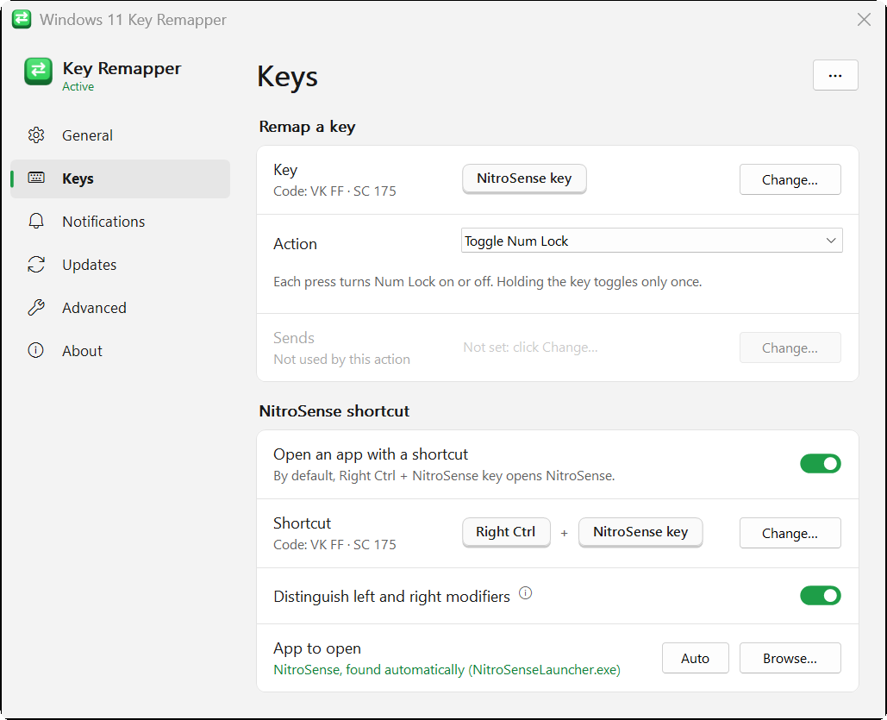

  

  
  
  
  
  

<h3 align="center">
  Keep hitting the NitroSense key instead of Num Lock or Backspace? 
  Turn it into Num Lock, disable it, or remap it — a small, free AutoHotkey app.
</h3>

  <a href="#installation"><b>Get started</b></a> ·
  <a href="#features"><b>Features</b></a> ·
  <a href="docs/FAQ.md"><b>FAQ</b></a> ·
  <a href="SUPPORT.md"><b>Help and feedback</b></a> ·
  <a href="#more"><b>More</b></a>

On Acer Nitro laptops the **NitroSense key** sits right next to Backspace and
Num Lock. One slip and the NitroSense app pops up. **Windows 11 Key Remapper**
is a tiny tray app that gives that key a better job — or any other key you pick.

  

---

## 🚀 Get started

The app is an [AutoHotkey v2](https://www.autohotkey.com/) script. AutoHotkey is
free, open source and signed, so it also runs with Windows 11's *Smart App
Control* on. (There's no exe for now: [why?](docs/FAQ.md#why-no-exe))

1. Install [AutoHotkey v2](https://www.autohotkey.com/) (*Download v2.0* → run
   the installer, default options).

2. Download `Win11KeyRemapper-vX.Y.Z.zip` from the
   [latest release](https://github.com/Ricardokraus/Win11-Key-Remapper-Acer-Nitrosense/releases/latest)
   and extract it to a folder you'll keep, for example `Documents\Win11KeyRemapper`
   (not *Downloads*: *Start with Windows* points to wherever the app is).

3. Double-click **`src\Win11KeyRemapper.ahk`**.

4. The settings window opens on *Keys*. Pick what the NitroSense key should do —
   changes apply at once. *Start with Windows* is already on. Close the window:
   the app lives in the tray. Double-click its icon, or open the app again, to
   come back.

Everything is changed from the settings window. If you'd rather edit a text file,
`src\settings.ini` explains every option inside it (open it from *Settings* →
*Advanced* → *Open folder*), and [`settings.example.ini`](settings.example.ini)
shows them all with their defaults.

## ✨ Features

<b>See all features</b>

 

- **Remap the NitroSense key** (or any key) to another key or shortcut — **Num
  Lock** by default — or make it do nothing.

- **Holding it toggles Num Lock once** (or Caps / Scroll Lock), not over and
  over; other keys repeat like the real key.

- **Built-in key detector**: click *Change…*, press a key or a combination, done.

- **A shortcut to open NitroSense** (default: <kbd>Right Ctrl</kbd> + NitroSense
  key). It finds the app by itself, Microsoft Store version included, or opens any
  app you choose.

- **Windows 11 style settings**: a sidebar with sections, **light and dark
  mode**, changes applied at once, small animations, sharp on every monitor.

- **Notifications your way**: always (at startup, after unlocking, when the
  screen turns on), only at startup, or never; six positions, three animations,
  frosted glass or solid.

- **A tiny tray menu** (settings, pause, restart, exit), or **no tray icon** at
  all.

- **Tells you about new versions**: checks GitHub once a day (you can turn it
  off).

- **Light**: no admin rights, no driver, no service, no CPU use while idle.

- **Free and open source** (MIT).

  <picture>
    <source media="(prefers-color-scheme: dark)" srcset="assets/screenshot-dark.png">
    
  </picture>

## 🔄 Updating and uninstalling

<b>How to update</b>

 

When there's a new version, the app tells you (*Settings* → *Updates*), and
*Download* opens the release page. Then:

1. Click *Exit* in the app (settings → *General* → *App*, or tray icon → *Exit*).

2. Download the new zip and extract it **over the same folder**, replacing the
   files. Your `settings.ini` isn't in the zip, so it stays.

3. Double-click `src\Win11KeyRemapper.ahk` again.

<b>How to uninstall</b>

 

1. In the settings (*General*), turn off *Start with Windows*.

2. Click *Exit* under *App* (or tray icon → *Exit*).

3. Delete the app's folder, and `%APPDATA%\Win11KeyRemapper` if it exists.
   Nothing else is installed.

If you don't use AutoHotkey for anything else, you can uninstall it from
Windows' *Installed apps*.

## 📚 More

| Page | What you'll find |
|---|---|
| ❓ **[FAQ](docs/FAQ.md)** | Common questions: AutoHotkey, antivirus warnings, Task Manager, Win Lock, the settings file… |
| 💻 **[Tested models](docs/TESTED-MODELS.md)** | Laptops it works on. Tried it on yours? Tell us, even if it didn't work! |
| 💬 **[Help and feedback](SUPPORT.md)** | Report a bug, suggest an idea or ask a question, step by step. |
| 🛠️ **[Contributing](CONTRIBUTING.md)** | Help with code or docs. |
| 📜 **[Changelog](CHANGELOG.md)** | What changed in each version. |
| 🔒 **[Security](SECURITY.md)** | What the app does with your keys, and how to report a security problem privately. |

---

If the app helps you, a ⭐ helps others find it.

<a href="https://star-history.com/#Ricardokraus/Win11-Key-Remapper-Acer-Nitrosense&Date">
  <picture>
    <source media="(prefers-color-scheme: dark)" srcset="https://api.star-history.com/svg?repos=Ricardokraus/Win11-Key-Remapper-Acer-Nitrosense&type=Date&theme=dark">
    
  </picture>
</a>

## 📄 License

[MIT](LICENSE) © 2026 Ricardo
